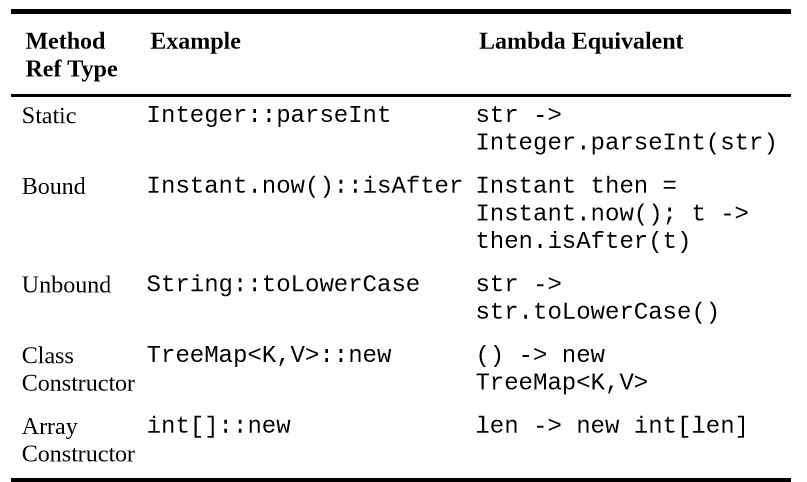

## Lambda - OCA
 In Java 8, the language added the ability to write code using another style. **Functional programming** is a way of writing code more declaratively. You specify what you want to do rather than dealing with the state of objects. **You focus more on expressions than loops**.
 ### Lambda expression
Functional programming uses **lambda expressions** to write code. **A lambda expression is a block of code that gets passed around**. 
It has **parameters** and a **body** just like full-fledged methods do, but it doesn’t have a name like a real method. Lambda expressions are often referred to as *lambdas* for short. In other words, a lambda expression is like a method that you can pass as if it were a variable.

### Lambda Syntax
```
public class Animal { 
    private String species; 
    private boolean canHop;
    private boolean canSwim;
    public Animal(String speciesName, boolean hopper, boolean swimmer) { 
        species = speciesName; 
        canHop = hopper; 
        canSwim = swimmer;  
    }   
    public boolean canHop() { return canHop; } 
}
```

We plan to write a lot of different checks, so we want an interface. For now, it is enough to remember that an interface specifies the methods that our class needs to implement:
```$xslt
public interface CheckTrait { 
 boolean test(Animal a); 
}
```
The first thing we want to check is whether the Animal can hop. We provide a class that can check this:

```$xslt
public class CheckIfHopper implements CheckTrait {
  public boolean test(Animal a) {
      return a.canHop();  
  } 
}
```

One of the simplest lambda expressions you can write is: `a -> a.canHop();`

This means that Java should call a method with an `Animal` parameter that returns a `boolean` value that’s the result of `a.canHop()`. We know all this because we wrote the code. But how does Java know? Java relies on **context** when figuring out what lambda expressions mean.

The syntax of lambdas is tricky because many parts are optional. These two lines do the exact same thing:

```
a -> a.canHop()
(Animal a) -> { return a.canHop(); }
```
Let’s look at what is going on here. The first example, shown in Figure 4.5, has three parts:
   - Specify a single parameter with the name a
   - The arrow operator to separate the parameter and body 
   - A body that calls a single method and returns the result of that method
   
   
   
 The second example also has three parts; it’s just more verbose (see Figure 4.6):
   - Specify a single parameter with the name a and stating the type is Animal
   - The arrow operator to separate the parameter and body 
   - A body that has one or more lines of code, including a semicolon and a return statement

   
   
   The parentheses can **only** be omitted if there is a **single parameter and its type is not explicitly stated**. Java does this because developers 
   commonly use lambda expressions this way and they can do as little typing as possible.
   
   It shouldn’t be news to you that we can omit braces when we only have a single statement. We did this with if statements and loops already. What is different here is that the rules change when you omit the braces.
   Java doesn’t require you to type return or use a semicolon when no braces are used. This special shortcut doesn’t work when we have two or more statements.
   
   There is one more issue you might see with lambdas. We’ve been defining an argument list in our lambda expressions.
   Since Java doesn’t allow us to redeclare a local variable, the following is an issue:
   ```
   (a, b) -> { int a = 0; return 5;}     // DOES NOT COMPILE
   ```
   We tried to redeclare `a`, which is not allowed. By contrast, the following line is okay because it uses a different variable name:
   ```
   (a, b) -> { int c = 0; return 5;} 
   ```
   ### Predicates
   In our earlier example, we created an interface with one method:

   `boolean test(Animal a);`
   
   Lambdas work with interfaces that have only one method. These are called functional interfaces—interfaces that can be used with functional programming.
   You can imagine that we’d have to create lots of interfaces like this to use lambdas. We want to test `Animals` and `Strings` and `Plants` and anything else that we come across.
   Luckily, Java recognizes that this is a common problem and provides such an interface for us. It’s in the package `java.util.function` and the gist of it is as follows:
    
   ```
    public interface Predicate<T> { 
        boolean test(T t); 
    }
   ```
   
   Java 8 even integrated the `Predicate` interface into some existing classes. For example, `ArrayList` declares a `removeIf()` method that takes a `Predicate`.

   ## Lambda - Effective Java
   
   ### Prefer lambdas to anonymous classes 
   Historically, interfaces	(or, rarely, abstract classes) with	a single abstract method were used	as	function types.
   Their instances,	known as **function	objects**, represent functions	or	actions.
   Since JDK 1.1 was released in 1997, the primary means of creating a function	object was the anonymous class.	Here’s a code snippet to sort a	list of	strings	in order of	length,	using an anonymous class to	create the sort’s comparison function (which imposes the sort order): 
   ```
    Collections.sort(words, new Comparator <String>(){
           public int compare(String s1, String s2)	{
               return Integer.compare(s1.length(), s2.length()); 
           }
    }); 
  ```
  
  Anonymous	classes	were adequate for the classic objected-oriented	design patterns	requiring function	objects, notably the *Strategy	pattern*.
  The **Comparator interface represents an abstract	strategy** for sorting;	the anonymous class	above is a *concrete strategy* for	sorting	strings.
  The verbosity of anonymous classes, however,	made functional	programming	in Java	an unappealing	prospect. 
  
  In Java 8, the language formalized the notion	that **interfaces with a single abstract method** are special and deserve special treatment.
  These	interfaces	are now	known as **functional interfaces**, and	the	language allows	you	to create instances	of these interfaces using lambdas.
  Lambdas are similar in function to anonymous	classes, but far more concise. Here’s how the code	snippet	above looks	with the anonymous class replaced by a lambda. The	boilerplate	is gone, and the behavior is clearly evident:
  
  ```
    Collections.sort(words, (s1, s2) -> Integer.compare(s1.length(), s2.length())); 
```

Note that the types	of the lambda `(Comparator<String>)`, of its parameters	(`s1` and `s2`,	both `String`),	and	of its return value	(`int`)	are	not present	in the code.
The	compiler deduces these types from context, using a process	known as **type	inference**. In	some cases,	the	compiler won’t be able to determine	the	types, and	you’ll have	to specify them.

**Omit the types of all	lambda parameters unless their presence	makes your program clearer**.
If the	compiler generates an error	telling	you	it **can’t infer the type of a	lambda parameter**,	then specify it. Sometimes you may have	to cast	the	return value or the	entire lambda expression, but this	is	rare.

Unlike methods and classes,	lambdas	**lack names and documentation**; if a computation	isn’t self-explanatory,	or	exceeds	a few lines, don’t put it in a lambda.
One	line is	ideal for a	lambda,	and	three lines	is a reasonable maximum. If	you	violate	this rule, it can cause	serious	harm to	the	readability	of your	programs.
If a lambda	is long	or difficult to	read, either find a	way	to simplify	it or refactor your	program	to eliminate it.
Also, the **arguments passed to enum constructors are	evaluated in a static context**. Thus, **lambdas in	enum constructors can’t	access instance	members	of the enum**.

Lambdas	are	limited	to functional interfaces. If you want to create	an	instance of	an	abstract class,	you can	do it with an anonymous	class, but not a lambda.
Similarly, you can	use anonymous classes to create	instances of interfaces	with multiple abstract methods.	
Finally, a **lambda cannot obtain a	reference to itself**. In a	lambda,	the `this` keyword	refers	to	the	**enclosing	instance**,	which is typically	what you want.
In an anonymous	class, the `this` keyword refers to	the	**anonymous	class instance**. If you need access to	the	function object	from within	its	body, then you must	use	an anonymous class.

   ### Prefer method references to lambdas

The	primary	advantage of lambdas over anonymous	classes	is that	they are more succinct.	Java provides a	way	to generate	function objects even more succinct than lambdas: **method references**.
Here is	a code snippet from	a program that maintains a map from	arbitrary keys to **Integer** values. If the value is interpreted as a count of	the	number of instances of the key,	then the program is a multiset implementation.
The	function of	the	code snippet is	to associate the number	1 with the key if it is	not	in the map and to increment	the	associated value if	the	key	is already	present: 

`map.merge(key,	1,	(count,	incr)	->	count	+	incr); `


Note that this code	uses the **merge** method, which was added to the **Map** interface	in	Java 8. If no mapping is present for the given	key, the method	simply inserts the given value;
if a mapping is	already	present, merge applies the given function to the current value and the given value and overwrites the current value	with the result.
This code represents a typical use case	for	the	**merge** method.

 The code reads	nicely,	but	there’s	still some	boilerplate. The parameters *count*	and	*incr* don’t add much value, and they take up a	fair amount	of space.
 Really,	all	the	lambda	tells	you	is	that	the	function returns the sum of	its two	arguments. As of Java 8, **Integer (and	all	the	other boxed	numerical primitive	types)**
 provides a	static method **sum** that does	exactly	the	same thing. We can	simply	pass a reference to	this method	and	get	the	same result	with less visual clutter: 

`map.merge(key,	1,	Integer::sum); `

The	more parameters	a method has, the more boilerplate you	can	eliminate with a method	reference. In some lambdas,	however, the parameter names you choose provide	useful	documentation,
making	the	lambda	more readable and maintainable	than a	method	reference, even	if	the	lambda	is	longer. 


Many method	references	refer to **static methods**, but there are *four kinds that do not*. Two of	them are **bound** and **unbound** instance method	references.

In **bound references**, *the receiving object is specified	in	the	method	reference*. Bound references are similar in nature to static references: the function object takes the same arguments as the referenced	method.
In **unbound references**, *the receiving object is	specified when the	function object	is	applied, via an additional	parameter before the method’s declared parameters*.
Unbound references	are	often used as **mapping and	filter** functions	in	stream	pipelines.

Finally, there are two kinds of	**constructor references**,	for	**classes and arrays**.	Constructor	references serve as	factory	objects.
All	five kinds of method references	are	summarized	in	the	table	below:

  